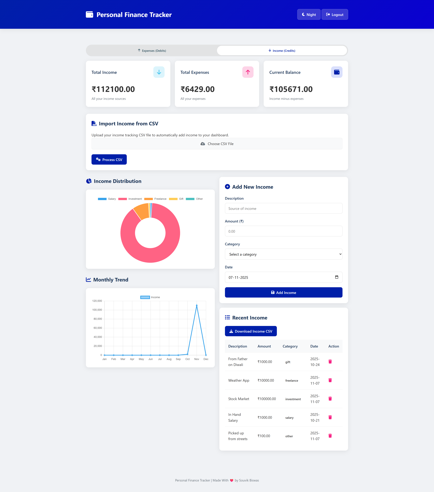
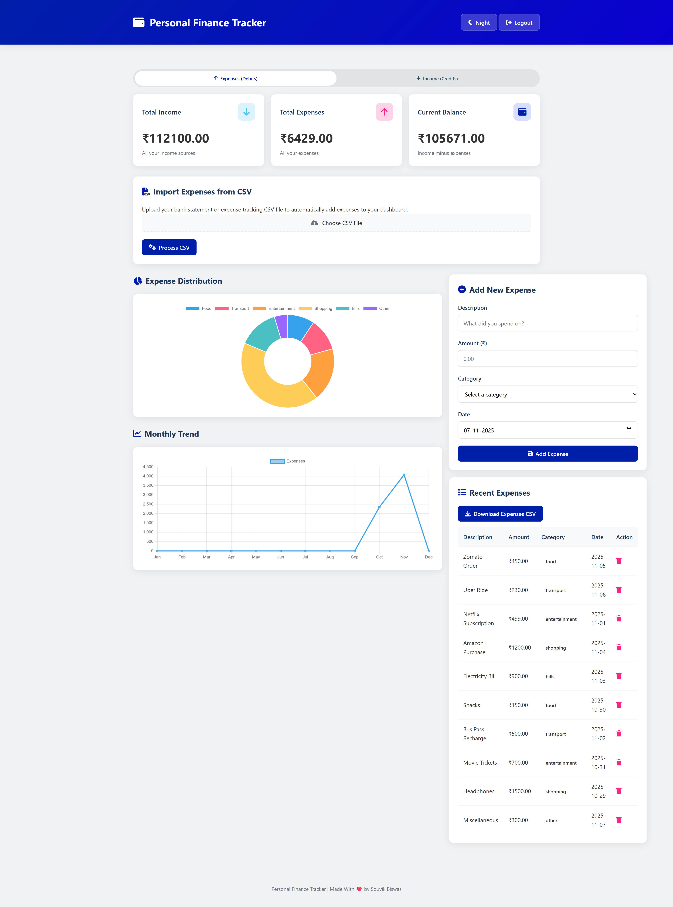

# 💰 Personal Finance Tracker

A sleek, modern, and **privacy-focused web app** to track your income and expenses 💸.
Supports **CSV import/export**, **category-based charts**, **dark mode 🌙**, and **per-user storage** — all stored securely in your **browser’s local storage** 🔒.

---

## 🚀 Features

✨ **User Authentication**

* Login / Signup system with `SHA-256` password hashing 🔐
* User-specific data storage (your data stays yours!)

📊 **Interactive Dashboard**

* Dynamic charts for Income & Expense Distribution (via `Chart.js`)
* Monthly Trend Graphs 📈

💼 **Income & Expense Management**

* Add, delete, and view all your records
* Category tagging for better insights 🎯
* Real-time balance updates

📂 **CSV Import/Export**

* Import your bank statements or expense logs easily 🧾
* Download your data anytime as CSV.

🌗 **Theme Toggle**

* Switch between **Light ☀️** and **Dark 🌙** modes seamlessly

🧠 **Local Storage Backup**

* All data is stored locally and persists even after reloads
* JSON backup & restore support

---

## 🛠️ Tech Stack

| Component          | Technology                           |
| ------------------ | ------------------------------------ |
| **Frontend**       | HTML5, CSS3, JavaScript (Vanilla JS) |
| **Charts**         | Chart.js 📈                          |
| **Icons**          | Font Awesome 🔥                      |
| **Storage**        | LocalStorage API                     |
| **Authentication** | SHA-256 Hashing via Web Crypto API   |

---

## 📸 Screenshots

📋 **Dashboard Overview**
💡 Income & Expense summary cards
📊 Beautiful interactive charts
🌙 Dark mode for late-night budgeting

<p align="center">
 
&nbsp; &nbsp;

</p>

---

## 🧭 Project Structure

```
📦 Personal Finance Tracker
├── pages/         
|   └── index.html      # Main dashboard
├── auth.html           # Login/Signup page
├── script.js           # Core app logic (storage, charts, CRUD)
├── style.css           # App styling (light/dark themes) 
├── DemoCSV/            # CSV Demo Template Files
└── screenshots/        # Screenshots of the Dashboard        
```

---

## ⚙️ How to Run

1. Clone or download this repo:

   ```bash
   git clone https://github.com/yourusername/finance-tracker.git
   cd finance-tracker
   ```

2. Open `auth.html` in your browser 🌐

3. Sign up with a new account 🧑‍💼

4. Start adding your income and expenses 💰

---

## 🧩 CSV Format

CSV files should follow this format:

### ➖Expenses: [Download Demo CSV ⬇️](DemoCSV/souvik_expenses_2025-11-07.csv)

```
Description,Amount,Category,Date
"Zomato Order",450,"food","2025-11-05"
"Uber Ride",230,"transport","2025-11-06"
"Netflix Subscription",499,"entertainment","2025-11-01"
"Amazon Purchase",1200,"shopping","2025-11-04"
"Electricity Bill",900,"bills","2025-11-03"
"Snacks",150,"food","2025-10-30"
"Bus Pass Recharge",500,"transport","2025-11-02"
"Movie Tickets",700,"entertainment","2025-10-31"
"Headphones",1500,"shopping","2025-10-29"
"Miscellaneous",300,"other","2025-11-07"
```


### ➕Income: [Download Demo CSV ⬇️](DemoCSV/souvik_income_2025-11-07.csv)
```
Description,Amount,Category,Date
"From Father on Diwali",1000,"gift","2025-10-24"
"Weather App",10000,"freelance","2025-11-07"
"Stock Market",100000,"investment","2025-11-07"
"In Hand Salary",1000,"salary","2025-10-21"
"Picked up from streets",100,"other","2025-11-07"
```

---

## 🔐 Security

* Passwords are **hashed using SHA-256** before storage (never stored in plain text).
* All data stays **local to your browser** — no external database or server involved.

---

## 💾 Data Persistence

Each user’s data is saved under:

```
localStorage.financeTracker_<username>
```

This includes:

* Income list
* Expense list
* Category totals
* Trend data

---

## 💡 Future Enhancements

* ☁️ Cloud sync option
* 📱 Mobile responsive improvements
* 🔔 Budget alerts & reminders

---

## ❤️ Credits

Made with ❤️ by **Souvik Biswas**
📧 Feedback welcome!